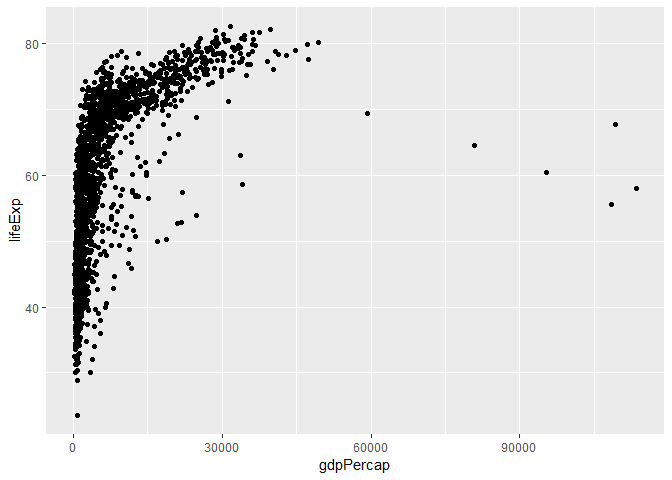

In this illustration, the Gapminder package is used for plotting charts.  This data set comes with six variables including country, continent, year, life expectancy, population and GDP per capita. 

Let's install the package, load the data and examine the dataset:

```r
install.packages("gapminder", repos = "https://cran.r-project.org")
library(gapminder)
```

```
## Warning: package 'gapminder' was built under R version 3.5.3
```

```r
summary(gapminder) # Summary of Gapminder dataset
str(gapminder) # Structure of dataset

gm=gapminder
head(gm)
summary(gm)
```


Simple Scatterplot:


```r
library(ggplot2)
```

```
## Warning: package 'ggplot2' was built under R version 3.5.2
```

```r
p <- ggplot(data = gm,
            mapping = aes(x = gdpPercap,
                          y = lifeExp))  # Shows nothing. Why?
p + geom_point()
```

<!-- -->

```r
  theme_bw()
```

```
## List of 59
##  $ line                 :List of 6
##   ..$ colour       : chr "black"
##   ..$ size         : num 0.5
##   ..$ linetype     : num 1
##   ..$ lineend      : chr "butt"
##   ..$ arrow        : logi FALSE
##   ..$ inherit.blank: logi TRUE
##   ..- attr(*, "class")= chr [1:2] "element_line" "element"
##  $ rect                 :List of 5
##   ..$ fill         : chr "white"
##   ..$ colour       : chr "black"
##   ..$ size         : num 0.5
##   ..$ linetype     : num 1
##   ..$ inherit.blank: logi TRUE
##   ..- attr(*, "class")= chr [1:2] "element_rect" "element"
##  $ text                 :List of 11
##   ..$ family       : chr ""
##   ..$ face         : chr "plain"
##   ..$ colour       : chr "black"
##   ..$ size         : num 11
##   ..$ hjust        : num 0.5
##   ..$ vjust        : num 0.5
##   ..$ angle        : num 0
##   ..$ lineheight   : num 0.9
##   ..$ margin       : 'margin' num [1:4] 0pt 0pt 0pt 0pt
##   .. ..- attr(*, "valid.unit")= int 8
##   .. ..- attr(*, "unit")= chr "pt"
##   ..$ debug        : logi FALSE
##   ..$ inherit.blank: logi TRUE
##   ..- attr(*, "class")= chr [1:2] "element_text" "element"
##  $ axis.title.x         :List of 11
##   ..$ family       : NULL
##   ..$ face         : NULL
##   ..$ colour       : NULL
##   ..$ size         : NULL
##   ..$ hjust        : NULL
##   ..$ vjust        : num 1
##   ..$ angle        : NULL
##   ..$ lineheight   : NULL
##   ..$ margin       : 'margin' num [1:4] 2.75pt 0pt 0pt 0pt
##   .. ..- attr(*, "valid.unit")= int 8
##   .. ..- attr(*, "unit")= chr "pt"
##   ..$ debug        : NULL
##   ..$ inherit.blank: logi TRUE
##   ..- attr(*, "class")= chr [1:2] "element_text" "element"
##  $ axis.title.x.top     :List of 11
##   ..$ family       : NULL
##   ..$ face         : NULL
##   ..$ colour       : NULL
##   ..$ size         : NULL
##   ..$ hjust        : NULL
##   ..$ vjust        : num 0
##   ..$ angle        : NULL
##   ..$ lineheight   : NULL
##   ..$ margin       : 'margin' num [1:4] 0pt 0pt 2.75pt 0pt
##   .. ..- attr(*, "valid.unit")= int 8
##   .. ..- attr(*, "unit")= chr "pt"
##   ..$ debug        : NULL
##   ..$ inherit.blank: logi TRUE
##   ..- attr(*, "class")= chr [1:2] "element_text" "element"
##  $ axis.title.y         :List of 11
##   ..$ family       : NULL
##   ..$ face         : NULL
##   ..$ colour       : NULL
##   ..$ size         : NULL
##   ..$ hjust        : NULL
##   ..$ vjust        : num 1
##   ..$ angle        : num 90
##   ..$ lineheight   : NULL
##   ..$ margin       : 'margin' num [1:4] 0pt 2.75pt 0pt 0pt
##   .. ..- attr(*, "valid.unit")= int 8
##   .. ..- attr(*, "unit")= chr "pt"
##   ..$ debug        : NULL
##   ..$ inherit.blank: logi TRUE
##   ..- attr(*, "class")= chr [1:2] "element_text" "element"
##  $ axis.title.y.right   :List of 11
##   ..$ family       : NULL
##   ..$ face         : NULL
##   ..$ colour       : NULL
##   ..$ size         : NULL
##   ..$ hjust        : NULL
##   ..$ vjust        : num 0
##   ..$ angle        : num -90
##   ..$ lineheight   : NULL
##   ..$ margin       : 'margin' num [1:4] 0pt 0pt 0pt 2.75pt
##   .. ..- attr(*, "valid.unit")= int 8
##   .. ..- attr(*, "unit")= chr "pt"
##   ..$ debug        : NULL
##   ..$ inherit.blank: logi TRUE
##   ..- attr(*, "class")= chr [1:2] "element_text" "element"
##  $ axis.text            :List of 11
##   ..$ family       : NULL
##   ..$ face         : NULL
##   ..$ colour       : chr "grey30"
##   ..$ size         : 'rel' num 0.8
##   ..$ hjust        : NULL
##   ..$ vjust        : NULL
##   ..$ angle        : NULL
##   ..$ lineheight   : NULL
##   ..$ margin       : NULL
##   ..$ debug        : NULL
##   ..$ inherit.blank: logi TRUE
##   ..- attr(*, "class")= chr [1:2] "element_text" "element"
##  $ axis.text.x          :List of 11
##   ..$ family       : NULL
##   ..$ face         : NULL
##   ..$ colour       : NULL
##   ..$ size         : NULL
##   ..$ hjust        : NULL
##   ..$ vjust        : num 1
##   ..$ angle        : NULL
##   ..$ lineheight   : NULL
##   ..$ margin       : 'margin' num [1:4] 2.2pt 0pt 0pt 0pt
##   .. ..- attr(*, "valid.unit")= int 8
##   .. ..- attr(*, "unit")= chr "pt"
##   ..$ debug        : NULL
##   ..$ inherit.blank: logi TRUE
##   ..- attr(*, "class")= chr [1:2] "element_text" "element"
##  $ axis.text.x.top      :List of 11
##   ..$ family       : NULL
##   ..$ face         : NULL
##   ..$ colour       : NULL
##   ..$ size         : NULL
##   ..$ hjust        : NULL
##   ..$ vjust        : num 0
##   ..$ angle        : NULL
##   ..$ lineheight   : NULL
##   ..$ margin       : 'margin' num [1:4] 0pt 0pt 2.2pt 0pt
##   .. ..- attr(*, "valid.unit")= int 8
##   .. ..- attr(*, "unit")= chr "pt"
##   ..$ debug        : NULL
##   ..$ inherit.blank: logi TRUE
##   ..- attr(*, "class")= chr [1:2] "element_text" "element"
##  $ axis.text.y          :List of 11
##   ..$ family       : NULL
##   ..$ face         : NULL
##   ..$ colour       : NULL
##   ..$ size         : NULL
##   ..$ hjust        : num 1
##   ..$ vjust        : NULL
##   ..$ angle        : NULL
##   ..$ lineheight   : NULL
##   ..$ margin       : 'margin' num [1:4] 0pt 2.2pt 0pt 0pt
##   .. ..- attr(*, "valid.unit")= int 8
##   .. ..- attr(*, "unit")= chr "pt"
##   ..$ debug        : NULL
##   ..$ inherit.blank: logi TRUE
##   ..- attr(*, "class")= chr [1:2] "element_text" "element"
##  $ axis.text.y.right    :List of 11
##   ..$ family       : NULL
##   ..$ face         : NULL
##   ..$ colour       : NULL
##   ..$ size         : NULL
##   ..$ hjust        : num 0
##   ..$ vjust        : NULL
##   ..$ angle        : NULL
##   ..$ lineheight   : NULL
##   ..$ margin       : 'margin' num [1:4] 0pt 0pt 0pt 2.2pt
##   .. ..- attr(*, "valid.unit")= int 8
##   .. ..- attr(*, "unit")= chr "pt"
##   ..$ debug        : NULL
##   ..$ inherit.blank: logi TRUE
##   ..- attr(*, "class")= chr [1:2] "element_text" "element"
##  $ axis.ticks           :List of 6
##   ..$ colour       : chr "grey20"
##   ..$ size         : NULL
##   ..$ linetype     : NULL
##   ..$ lineend      : NULL
##   ..$ arrow        : logi FALSE
##   ..$ inherit.blank: logi TRUE
##   ..- attr(*, "class")= chr [1:2] "element_line" "element"
##  $ axis.ticks.length    : 'unit' num 2.75pt
##   ..- attr(*, "valid.unit")= int 8
##   ..- attr(*, "unit")= chr "pt"
##  $ axis.line            : list()
##   ..- attr(*, "class")= chr [1:2] "element_blank" "element"
##  $ axis.line.x          : NULL
##  $ axis.line.y          : NULL
##  $ legend.background    :List of 5
##   ..$ fill         : NULL
##   ..$ colour       : logi NA
##   ..$ size         : NULL
##   ..$ linetype     : NULL
##   ..$ inherit.blank: logi TRUE
##   ..- attr(*, "class")= chr [1:2] "element_rect" "element"
##  $ legend.margin        : 'margin' num [1:4] 5.5pt 5.5pt 5.5pt 5.5pt
##   ..- attr(*, "valid.unit")= int 8
##   ..- attr(*, "unit")= chr "pt"
##  $ legend.spacing       : 'unit' num 11pt
##   ..- attr(*, "valid.unit")= int 8
##   ..- attr(*, "unit")= chr "pt"
##  $ legend.spacing.x     : NULL
##  $ legend.spacing.y     : NULL
##  $ legend.key           :List of 5
##   ..$ fill         : chr "white"
##   ..$ colour       : logi NA
##   ..$ size         : NULL
##   ..$ linetype     : NULL
##   ..$ inherit.blank: logi TRUE
##   ..- attr(*, "class")= chr [1:2] "element_rect" "element"
##  $ legend.key.size      : 'unit' num 1.2lines
##   ..- attr(*, "valid.unit")= int 3
##   ..- attr(*, "unit")= chr "lines"
##  $ legend.key.height    : NULL
##  $ legend.key.width     : NULL
##  $ legend.text          :List of 11
##   ..$ family       : NULL
##   ..$ face         : NULL
##   ..$ colour       : NULL
##   ..$ size         : 'rel' num 0.8
##   ..$ hjust        : NULL
##   ..$ vjust        : NULL
##   ..$ angle        : NULL
##   ..$ lineheight   : NULL
##   ..$ margin       : NULL
##   ..$ debug        : NULL
##   ..$ inherit.blank: logi TRUE
##   ..- attr(*, "class")= chr [1:2] "element_text" "element"
##  $ legend.text.align    : NULL
##  $ legend.title         :List of 11
##   ..$ family       : NULL
##   ..$ face         : NULL
##   ..$ colour       : NULL
##   ..$ size         : NULL
##   ..$ hjust        : num 0
##   ..$ vjust        : NULL
##   ..$ angle        : NULL
##   ..$ lineheight   : NULL
##   ..$ margin       : NULL
##   ..$ debug        : NULL
##   ..$ inherit.blank: logi TRUE
##   ..- attr(*, "class")= chr [1:2] "element_text" "element"
##  $ legend.title.align   : NULL
##  $ legend.position      : chr "right"
##  $ legend.direction     : NULL
##  $ legend.justification : chr "center"
##  $ legend.box           : NULL
##  $ legend.box.margin    : 'margin' num [1:4] 0cm 0cm 0cm 0cm
##   ..- attr(*, "valid.unit")= int 1
##   ..- attr(*, "unit")= chr "cm"
##  $ legend.box.background: list()
##   ..- attr(*, "class")= chr [1:2] "element_blank" "element"
##  $ legend.box.spacing   : 'unit' num 11pt
##   ..- attr(*, "valid.unit")= int 8
##   ..- attr(*, "unit")= chr "pt"
##  $ panel.background     :List of 5
##   ..$ fill         : chr "white"
##   ..$ colour       : logi NA
##   ..$ size         : NULL
##   ..$ linetype     : NULL
##   ..$ inherit.blank: logi TRUE
##   ..- attr(*, "class")= chr [1:2] "element_rect" "element"
##  $ panel.border         :List of 5
##   ..$ fill         : logi NA
##   ..$ colour       : chr "grey20"
##   ..$ size         : NULL
##   ..$ linetype     : NULL
##   ..$ inherit.blank: logi TRUE
##   ..- attr(*, "class")= chr [1:2] "element_rect" "element"
##  $ panel.spacing        : 'unit' num 5.5pt
##   ..- attr(*, "valid.unit")= int 8
##   ..- attr(*, "unit")= chr "pt"
##  $ panel.spacing.x      : NULL
##  $ panel.spacing.y      : NULL
##  $ panel.grid           :List of 6
##   ..$ colour       : chr "grey92"
##   ..$ size         : NULL
##   ..$ linetype     : NULL
##   ..$ lineend      : NULL
##   ..$ arrow        : logi FALSE
##   ..$ inherit.blank: logi TRUE
##   ..- attr(*, "class")= chr [1:2] "element_line" "element"
##  $ panel.grid.minor     :List of 6
##   ..$ colour       : NULL
##   ..$ size         : 'rel' num 0.5
##   ..$ linetype     : NULL
##   ..$ lineend      : NULL
##   ..$ arrow        : logi FALSE
##   ..$ inherit.blank: logi TRUE
##   ..- attr(*, "class")= chr [1:2] "element_line" "element"
##  $ panel.ontop          : logi FALSE
##  $ plot.background      :List of 5
##   ..$ fill         : NULL
##   ..$ colour       : chr "white"
##   ..$ size         : NULL
##   ..$ linetype     : NULL
##   ..$ inherit.blank: logi TRUE
##   ..- attr(*, "class")= chr [1:2] "element_rect" "element"
##  $ plot.title           :List of 11
##   ..$ family       : NULL
##   ..$ face         : NULL
##   ..$ colour       : NULL
##   ..$ size         : 'rel' num 1.2
##   ..$ hjust        : num 0
##   ..$ vjust        : num 1
##   ..$ angle        : NULL
##   ..$ lineheight   : NULL
##   ..$ margin       : 'margin' num [1:4] 0pt 0pt 5.5pt 0pt
##   .. ..- attr(*, "valid.unit")= int 8
##   .. ..- attr(*, "unit")= chr "pt"
##   ..$ debug        : NULL
##   ..$ inherit.blank: logi TRUE
##   ..- attr(*, "class")= chr [1:2] "element_text" "element"
##  $ plot.subtitle        :List of 11
##   ..$ family       : NULL
##   ..$ face         : NULL
##   ..$ colour       : NULL
##   ..$ size         : NULL
##   ..$ hjust        : num 0
##   ..$ vjust        : num 1
##   ..$ angle        : NULL
##   ..$ lineheight   : NULL
##   ..$ margin       : 'margin' num [1:4] 0pt 0pt 5.5pt 0pt
##   .. ..- attr(*, "valid.unit")= int 8
##   .. ..- attr(*, "unit")= chr "pt"
##   ..$ debug        : NULL
##   ..$ inherit.blank: logi TRUE
##   ..- attr(*, "class")= chr [1:2] "element_text" "element"
##  $ plot.caption         :List of 11
##   ..$ family       : NULL
##   ..$ face         : NULL
##   ..$ colour       : NULL
##   ..$ size         : 'rel' num 0.8
##   ..$ hjust        : num 1
##   ..$ vjust        : num 1
##   ..$ angle        : NULL
##   ..$ lineheight   : NULL
##   ..$ margin       : 'margin' num [1:4] 5.5pt 0pt 0pt 0pt
##   .. ..- attr(*, "valid.unit")= int 8
##   .. ..- attr(*, "unit")= chr "pt"
##   ..$ debug        : NULL
##   ..$ inherit.blank: logi TRUE
##   ..- attr(*, "class")= chr [1:2] "element_text" "element"
##  $ plot.tag             :List of 11
##   ..$ family       : NULL
##   ..$ face         : NULL
##   ..$ colour       : NULL
##   ..$ size         : 'rel' num 1.2
##   ..$ hjust        : num 0.5
##   ..$ vjust        : num 0.5
##   ..$ angle        : NULL
##   ..$ lineheight   : NULL
##   ..$ margin       : NULL
##   ..$ debug        : NULL
##   ..$ inherit.blank: logi TRUE
##   ..- attr(*, "class")= chr [1:2] "element_text" "element"
##  $ plot.tag.position    : chr "topleft"
##  $ plot.margin          : 'margin' num [1:4] 5.5pt 5.5pt 5.5pt 5.5pt
##   ..- attr(*, "valid.unit")= int 8
##   ..- attr(*, "unit")= chr "pt"
##  $ strip.background     :List of 5
##   ..$ fill         : chr "grey85"
##   ..$ colour       : chr "grey20"
##   ..$ size         : NULL
##   ..$ linetype     : NULL
##   ..$ inherit.blank: logi TRUE
##   ..- attr(*, "class")= chr [1:2] "element_rect" "element"
##  $ strip.placement      : chr "inside"
##  $ strip.text           :List of 11
##   ..$ family       : NULL
##   ..$ face         : NULL
##   ..$ colour       : chr "grey10"
##   ..$ size         : 'rel' num 0.8
##   ..$ hjust        : NULL
##   ..$ vjust        : NULL
##   ..$ angle        : NULL
##   ..$ lineheight   : NULL
##   ..$ margin       : 'margin' num [1:4] 4.4pt 4.4pt 4.4pt 4.4pt
##   .. ..- attr(*, "valid.unit")= int 8
##   .. ..- attr(*, "unit")= chr "pt"
##   ..$ debug        : NULL
##   ..$ inherit.blank: logi TRUE
##   ..- attr(*, "class")= chr [1:2] "element_text" "element"
##  $ strip.text.x         : NULL
##  $ strip.text.y         :List of 11
##   ..$ family       : NULL
##   ..$ face         : NULL
##   ..$ colour       : NULL
##   ..$ size         : NULL
##   ..$ hjust        : NULL
##   ..$ vjust        : NULL
##   ..$ angle        : num -90
##   ..$ lineheight   : NULL
##   ..$ margin       : NULL
##   ..$ debug        : NULL
##   ..$ inherit.blank: logi TRUE
##   ..- attr(*, "class")= chr [1:2] "element_text" "element"
##  $ strip.switch.pad.grid: 'unit' num 2.75pt
##   ..- attr(*, "valid.unit")= int 8
##   ..- attr(*, "unit")= chr "pt"
##  $ strip.switch.pad.wrap: 'unit' num 2.75pt
##   ..- attr(*, "valid.unit")= int 8
##   ..- attr(*, "unit")= chr "pt"
##  - attr(*, "class")= chr [1:2] "theme" "gg"
##  - attr(*, "complete")= logi TRUE
##  - attr(*, "validate")= logi TRUE
```

First, we need to start the data component, then add the aesthetic mapping defining the basics (i.e. variables), followed by the geometric objects.  Here is an alternative: 


```r
# Alternative
p <- ggplot(data=gm, aes(x=gdpPercap, y=lifeExp))
```

What is still missing?


```r
p + geom_point()
```

<!-- -->

Now, we can add more features to the chart.


```r
# Add some color grouping
p <- ggplot(data = gm,
            mapping = aes(x = gdpPercap,
                          y = lifeExp, color=continent))
p + geom_point()
```

<!-- -->
Now you can knit the Markdown file and publish it to either Rpub or your own github website!---
title: "RMarkdown demo"
author: "Collin DeVore"
date: "March 27, 2019"
output: html_document
---
